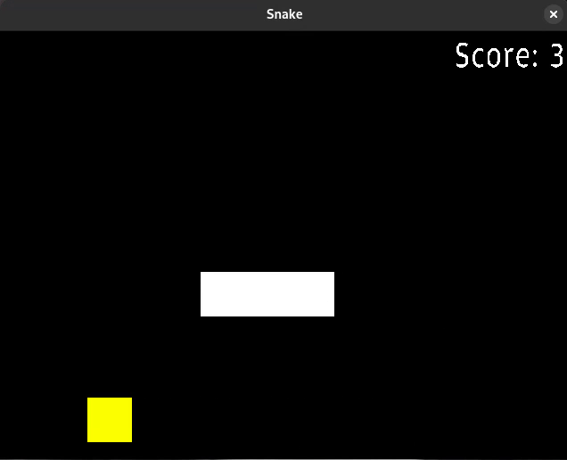

# snake

## Description

Small snake clone in SDL and C++

## Build and run

```shell
  nix develop
  make
  ./build/snake
```

## Demo 




## Sonarcloud

[](https://sonarcloud.io/summary/new_code?id=NathanFouere_snake)
[](https://sonarcloud.io/summary/new_code?id=NathanFouere_snake)
[](https://sonarcloud.io/summary/new_code?id=NathanFouere_snake)
[](https://sonarcloud.io/summary/new_code?id=NathanFouere_snake)
[](https://sonarcloud.io/summary/new_code?id=NathanFouere_snake)